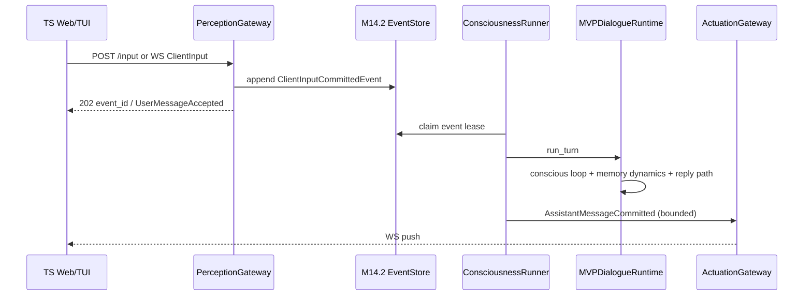
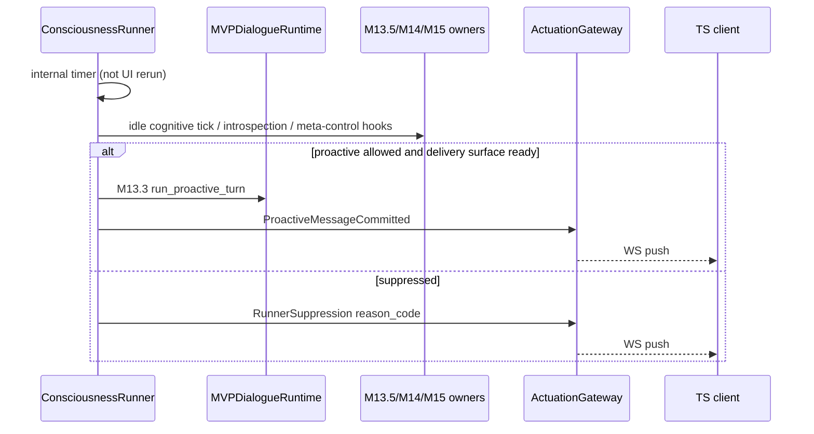

# M16.0 Consciousness Runner Contract

Date: 2026-05-28

## 1. Purpose

M16 inverts Path B control:

```text
Before M16: Streamlit rerun / UI timers drive idle ticks and proactive checks
After M16:  ConsciousnessRunner owns the self-loop; UI is perception/actuation only
```

The label **consciousness runner** is an engineering name for the Path B
self-loop owner. It does not claim subjective experience.

## 2. Module Boundaries

| Module | Role | May call LLM? | May mutate MVP state? |
|--------|------|---------------|------------------------|
| `PerceptionGateway` (HTTP/WS ingress) | Append durable perception events | No | No (except event store) |
| `ConsciousnessRunner` (M16.1+) | Claim events, schedule ticks, commit owners | Yes (existing Path B stages) | Yes (via named owners) |
| `ActuationGateway` (WS fan-out) | Project bounded actuation events to clients | No | No |
| `MVPDialogueRuntime` | Existing turn / idle cognition orchestration | Yes | Yes (via existing patches) |
| TypeScript Web/TUI | Render + publish input | No | No |

### Non-acceptance rule

After M16.3, **Streamlit is not an acceptance scheduler**. An open browser tab or
rerun cadence must not be required for silence-period cognition or proactive
preparation.

## 3. Durable Perception Log

M14.2 `environment_events.jsonl` remains the append-only perception ledger.
M16 adds event types:

```text
ClientInputCommittedEvent
DeliverySurfaceConnectedEvent
DeliverySurfaceReadyEvent
DeliverySurfaceDisconnectedEvent
RunnerControlCommandEvent
```

Rules:

- HTTP `POST /input` appends `ClientInputCommittedEvent` and returns `202`.
- The gateway thread must not call `run_turn` inline.
- Semantic interpretation stays inside existing LLM JSON stages in the runner.

## 4. Actuation Projection

Actuation types are durable enough for snapshot resync; WebSocket is a
projection, not source of truth:

```text
AssistantMessagePreparedEvent / AssistantMessageDeliveredEvent
ProactiveMessagePreparedEvent / ProactiveMessageDeliveredEvent
ProactiveDeliverySuppressedEvent
RunnerHealthEvent
```

Audit channel mapping (see `m16_protocol.ACTUATION_EVENT_AUDIT_MAP`):

- assistant/proactive **delivery** → existing `conversation_log` / `m13_proactive_audit`
- suppressions → `m13_proactive_audit` with closed `reason_code`
- runner health → `m14_2_audit`

Default client payloads must not include raw prompts, full memory dumps, full
conscious markdown, or internal patch bodies.

## 5. Delivery Surface

Proactive outbox drain requires **both**:

1. an active WebSocket subscription (`Subscribe` acknowledged), and
2. a fresh `DeliverySurfaceReady` client message (TTL 45s in M16.0 protocol)

A TCP connection alone is insufficient. This replaces Streamlit rerun as the
primary delivery-surface signal.

## 6. Crash / Lock Invariants

- One live consciousness runner per persona+session (extends M14.1/M14.2 lock).
- Event claims use leases; crashed consumers release work back to pending.
- Outbox/idempotency rules from M14.2 still apply.
- Losing all UI clients must not stop the runner loop.

## 7. Streamlit → Gateway Mapping

| Legacy Streamlit / ChatInterface | M16 gateway |
|----------------------------------|-------------|
| User send message | `POST .../input` or WS `ClientInput` |
| Page open / rerun idle check | WS `DeliverySurfaceReady` (not scheduler) |
| `maybe_run_idle_introspection` on rerun | Runner internal timer (M16.1) |
| `run_idle_cognitive_tick` from UI | Runner internal M13.5 entry |
| `maybe_propose_proactive_turn(implicit_idle_request=True)` | Runner + delivery surface + M13.3 |
| Sidebar diagnostics | `GET .../snapshot` + WS `AuditEvent` |
| Daemon start/stop | `POST .../runner/start|stop` |

Streamlit may remain a legacy adapter during M16.1–M16.3 dual-run; M16.4
defaults off UI-side scheduling.

## 8. Sequence — User Input



## 9. Sequence — Silence Tick



## 10. Gateway Security (M16.0 default)

Mutating HTTP routes require:

- localhost bind (`127.0.0.1` / `::1`), **or**
- `Authorization: Bearer <dev_token>` matching configured secret

Unauthenticated remote mutation is forbidden in M16.0.

## 11. Milestone Scope

M16.0 freezes this contract and schemas only. Implementation lands in M16.1
(runner + gateway) and M16.2–M16.4 (TS clients).

## 12. Preserved Path B Guardrails

- M8.9 state ownership and `MemoryWriteIntent`
- M13.3 delivery assessor and reply validation
- M13.6 traceable expectation discipline for proactive outreach
- M15.2 meta-control as engineering bias only
- No Path A / M10 revival
